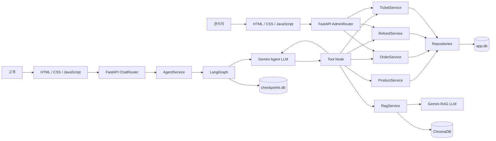

# 아키텍처와 Agent 동작 원리

[← README로 돌아가기](../README.md)

이 문서는 두 부분으로 구성됩니다. **실제 요청 처리 흐름 예시**는 고객이 실제로
입력한 문장이 내부적으로 어떻게 처리되는지 시나리오별로 보여주고, 그 아래
**주요 기능 상세**부터는 각 기능이 어떤 규칙으로 검증되고 동작하는지 레퍼런스
형태로 설명합니다. 실제 동작이 먼저 궁금하면 위에서부터, 설계 규칙이 궁금하면
"주요 기능 상세"로 바로 이동하세요.

---

## 실제 요청 처리 흐름 예시

### 자연어 상품 검색

<!-- 스크린샷: 자연어 상품 검색 대화 -->

```text
고객
"3만원대 빨간색 나이키 신발 보여줘"

    ↓

Agent Node
검색 의도와 조건 분석

    ↓

search_products Tool 호출
keywords=["나이키", "빨강", "신발"]
price_min=30000
price_max=39999

    ↓

ProductService
검색 조건과 가격 범위 검증

    ↓

ProductRepository
활성 상품 + 키워드 AND 검색 + 가격 범위 검색

    ↓

ToolMessage
구조화된 상품 검색 결과 반환

    ↓

Agent Node
상품명과 가격을 고객에게 안내
```

### 최저가 상품 안내

<!-- 스크린샷: 최저가 상품 안내 대화 -->

```text
고객
"가장 저렴한 신발 알려줘"

    ↓

Agent Node
상품 종류 조건 추출

    ↓

search_products Tool 호출
keywords=["신발"]

    ↓

Server
신발 상품 목록과 실제 가격 반환

    ↓

Agent Node
반환된 목록에서 가장 낮은 가격 비교

    ↓

가장 저렴한 신발 안내
```

### 주문 조회

<!-- 스크린샷: 주문 조회 대화 -->

```text
고객
"내 주문 보여줘"

    ↓

Agent Node
주문번호 없이 조회 요청 → 전체 목록 조회 의도로 판단

    ↓

get_orders Tool 호출
order_number 없음

    ↓

OrderService
get_customer_orders(user_id) 호출

    ↓

OrderRepository
현재 고객 소유 주문 전체 조회

    ↓

ToolMessage
주문 목록 반환

    ↓

Agent Node
"A1001 | 텀블러 500ml 외 1건 | 배송 완료 | 32,000원" 형식으로
한 건당 한 줄씩 안내
```

### 상품 주문

<!-- 스크린샷: 상품 주문 대화 -->

```text
고객
"텀블러 500ml 2개 주문할게요"

    ↓

search_products Tool 호출

    ↓

상품 ID와 가격 확인

    ↓

preview_order Tool 호출

    ↓

서버에서 상품명·단가·수량·예상 금액 계산

    ↓

Agent
"텀블러 500ml 2개, 총 24,000원입니다.
이대로 주문할까요?"

    ↓

고객
"네, 주문해주세요"

    ↓

create_order Tool 호출

    ↓

OrderService
상품 유효성 확인
→ Order와 OrderItem 생성
→ flush로 주문 ID 확보
→ ID 기반 주문번호 생성
→ commit

    ↓

Agent
생성된 주문번호와 주문 상태 안내
```

### 환불 요청

<!-- 스크린샷: 환불 요청 대화 -->

```text
고객
"A1006 주문 환불하고 싶어요, 사이즈가 안 맞아서요"

    ↓

Agent Node
환불 의도, 주문번호, 사유 추출

    ↓

request_refund Tool 호출
order_number="A1006"
reason="사이즈가 안 맞아서요"

    ↓

RefundService
① 환불 사유 확인
② OrderService로 주문 소유권·존재 확인
③ 주문 상태가 환불 가능한 상태(preparing/shipped/delivered)인지 확인
④ 동일 주문에 이미 pending 환불 요청이 있는지 확인

    ↓

RefundRepository
환불 요청을 pending 상태로 저장

    ↓

Agent Node
환불 요청 접수 완료 안내
```

### 정책 문서에 답이 없는 문의

<!-- 스크린샷: 정책 문서에 답이 없는 문의 대화 -->

```text
고객 질문
    ↓
search_policy Tool 호출
    ↓
정책 문서에서 관련 내용 확인 불가
    ↓
success=false
code=POLICY_NOT_FOUND
    ↓
Agent가 Tool 결과 해석
    ↓
save_support_ticket Tool 호출
    ↓
문의 내용을 open 상태로 저장
    ↓
상담원 확인이 필요하다는 최종 안내
```

---

## 주요 기능 상세

### 1. 정책 질문 답변

배송·주문·환불 정책 문서를 ChromaDB에서 검색하고, 검색된 문서 내용을 근거로 답변합니다.

```text
고객 질문
    ↓
search_policy Tool 호출
    ↓
질문 Embedding 생성
    ↓
ChromaDB 유사 문서 검색
    ↓
검색된 정책 문서를 Prompt에 포함
    ↓
Gemini가 정책 기반 답변 생성
```

정책 문서에서 질문과 관련된 내용을 찾지 못한 경우 임의로 답을 생성하지 않습니다.

`search_policy` Tool은 `POLICY_NOT_FOUND` 결과를 Agent에게 전달합니다. Agent는 해당 Tool 결과를 해석한 뒤 `save_support_ticket` Tool을 호출해 문의를 접수하도록 설계했습니다.

---

### 2. 자연어 상품 검색

상품 검색은 고객이 정확한 상품명만 입력하는 상황만을 기준으로 구현하지 않았습니다.

실제 채팅 사용자는 상품명보다 원하는 브랜드·색상·종류·특징·가격대를 조합해 다음과 같이 요청할 가능성이 높습니다.

```text
"빨간색 나이키 신발 보여줘"
"3만원대 운동화 있어?"
"파란색 반팔 옷 찾아줘"
"5만원 이하 신발 보여줘"
"가장 저렴한 옷이 뭐야?"
"나이키 제품 중 검은색 상품 찾아줘"
```

이를 처리하기 위해 각 상품에 상품명·종류·브랜드·색상·특징을 저장하는 검색용 `keywords` 컬럼을 추가했습니다.

Agent는 고객의 자연어 요청을 `keywords`, `price_min`, `price_max`와 같은 구조화된 Tool 입력으로 변환합니다. ProductService가 검색 조건을 검증하고, ProductRepository가 실제 상품을 조회합니다.

다음 검색 조건을 조합할 수 있습니다.

* 상품명
* 상품 종류
* 브랜드
* 색상
* 상품 특징
* 최소 가격
* 최대 가격
* 여러 키워드의 조합

여러 키워드가 전달되면 모든 조건을 만족하는 상품을 찾도록 AND 검색을 사용합니다.

또한 단순 문자열 포함 검색으로 인해 `"블루"`가 `"블루투스"`에 잘못 일치하는 문제를 방지하기 위해, 쉼표로 구분된 키워드 단위로 정확하게 매칭합니다.

```text
저장된 keywords
"나이키,신발,운동화,빨강,러닝"

검색 조건
["빨강", "신발"]

검색 결과
두 키워드를 모두 독립된 키워드로 포함한 상품만 반환
```

`"3만원대 신발"`과 같은 요청은 Agent가 가격 표현을 `price_min=30000`, `price_max=39999`로 구조화하고, 서버가 해당 가격 범위와 키워드를 만족하는 상품만 DB에서 검색합니다.

반면 `"가장 저렴한 신발"`과 같이 검색 결과 사이의 비교가 필요한 요청은 서버가 반환한 실제 상품 가격을 Agent가 비교해 안내합니다.

```text
"3만원대 신발"
자연어 가격 범위 해석 → Agent
가격 범위 검증 및 DB 검색 → Server

"가장 저렴한 신발"
신발 상품 목록과 실제 가격 조회 → Server
반환된 결과에서 최저가 상품 선택 → Agent
```

검색 결과에는 상품 ID, 상품명, 가격을 구조화된 데이터로 포함해 Agent가 실제 DB 조회 결과를 바탕으로 답변하도록 구성했습니다.

---

### 3. 주문 조회

현재 고객의 주문만 조회할 수 있습니다.

`get_orders` Tool은 주문번호의 전달 여부에 따라 동작이 달라집니다.

```text
order_number 없음
→ 현재 고객의 전체 주문 목록 조회

order_number 있음
→ 현재 고객의 주문 중 해당 주문번호와 일치하는 주문 1건 조회
```

Repository에서는 `user_id`와 `order_number`를 함께 조회 조건으로 사용합니다.

따라서 다른 고객의 주문번호를 입력하더라도 현재 고객의 주문이 아니면 조회되지 않습니다. 주문번호가 존재하지 않는 경우와 다른 고객의 주문인 경우는 동일하게 주문을 찾을 수 없는 것으로 처리합니다.

---

### 4. 주문 미리보기 및 생성

주문 미리보기와 실제 주문 생성을 서로 다른 Tool로 분리했습니다.

미리보기 단계에서는 상품명·단가·수량·예상 금액만 계산하며, DB에는 주문을 저장하지 않습니다. 이를 통해 상품이나 예상 금액을 확인하는 과정에서 의도하지 않은 주문이 생성되는 것을 방지했습니다.

주문 생성 과정은 다음과 같습니다.

```text
수량 검증
    ↓
주문 가능한 활성 상품 확인
    ↓
Order와 OrderItem 생성
    ↓
임시 주문번호로 Repository 저장
    ↓
flush를 이용해 Order ID 확보
    ↓
ID 기반 정식 주문번호 생성
    ↓
commit
```

주문 금액은 LLM이 직접 계산하지 않습니다.

```text
total_amount = product.price × quantity
```

단가, 수량, 합계는 서버에서 계산하고 LLM은 계산된 결과를 고객에게 안내합니다.

---

### 5. 환불 요청

환불은 주문 전체 단위로만 접수합니다.

RefundService는 다음 조건을 검증합니다.

* 환불 사유가 입력되었는지
* 주문이 현재 고객의 주문인지
* 현재 주문 상태에서 환불 요청이 가능한지
* 동일한 주문에 이미 `pending` 상태의 환불 요청이 존재하는지

검증을 통과하면 환불 요청을 `pending` 상태로 저장합니다.

부분 환불과 환불 승인·완료 처리는 현재 지원 범위에서 제외했습니다.

---

### 6. 문의 티켓 접수

Agent가 자동으로 처리할 수 없는 요청은 답변만 거절하고 종료하지 않고 문의 티켓으로 저장합니다.

문의 티켓의 접수 사유는 다음 네 가지로 제한합니다.

* 지원하지 않는 업무
* 정책 문서에 관련 내용 없음
* 필요한 Tool이 없음
* 사람의 확인이 필요함

SupportTicketService는 고객, 질문 내용, 접수 사유를 검증한 뒤 티켓을 `open` 상태로 저장합니다.

---

### 7. 관리자 기능

관리자 기능은 Agent와 LangGraph를 거치지 않습니다. 지원 문의 상태 변경이나
주문·환불 목록 조회는 자연어를 해석하거나 여러 Tool 중 하나를 선택할 필요가
없는 단순한 CRUD이기 때문에, admin_router.py가 Service를 직접 호출하도록
설계했습니다.

```text
관리자 요청 (예: 문의 상태 변경)
    ↓
AdminRouter
    ↓
SupportTicketService.update_ticket_status()
① status가 open/in_progress/resolved 중 하나인지 확인
② ticket_id로 문의 존재 여부 확인
    ↓
SupportTicketRepository
상태 변경 후 commit
    ↓
변경된 문의 정보 반환
```

순서 강제(예: open에서만 in_progress로 이동 가능)는 두지 않았습니다. 관리자가
실수로 바꾼 상태를 되돌리는 것까지 막을 이유가 없다고 판단해, "허용된 3개
값 중 하나인지"만 검증합니다.

주문·환불 조회는 각각 OrderService.get_all_orders(), RefundService.get_all_refunds()를
그대로 호출하는 읽기 전용 기능입니다. 환불 승인이나 주문 상태 변경 기능은
추가하지 않았습니다 (조회만 지원하기로 확정된 설계).

시간 표시(KST 변환)는 graph/tools.py의 `_format_order_time`과 동일한 로직을
사용하지만, tools.py를 직접 import하지 않고 admin_router.py에 같은 패턴으로
독립 구현했습니다. tools.py는 langchain_core에 의존하는 Agent 전용 모듈이라,
관리자 기능이 여기 의존하면 "관리자는 Agent를 거치지 않는다"는 설계 원칙과
실제 의존 관계가 어긋나기 때문입니다. 코드 몇 줄이 두 파일에 중복되는
트레이드오프를 감수했습니다.

---

## 핵심 설계 원칙

| 설계 원칙             | 설명                                                                              |
| ----------------- | ------------------------------------------------------------------------------- |
| LLM과 업무 로직 분리     | LLM은 의도 판단과 Tool 선택을 담당하고, 계산·검증·DB 변경은 서버 코드가 담당합니다.                           |
| 자연어 해석과 데이터 검색 분리 | Agent는 자연어를 구조화된 검색 조건으로 변환하고, 실제 상품 필터링은 Service와 Repository에서 수행합니다.          |
| 계층별 책임 분리         | Repository는 DB 접근, Service는 업무 규칙, Tool은 Agent와 Service 사이의 인터페이스를 담당합니다.       |
| 고객 정보 서버 고정       | `user_id`를 Tool 입력으로 LLM에 노출하지 않고, 고객별 Tool 생성 시 클로저로 고정합니다.                    |
| 서버에서 정확한 값 계산     | 주문 금액·수량·합계처럼 정확해야 하는 값은 서버에서 계산하고 LLM은 결과를 안내만 합니다.                            |
| 명시적 동의 후 데이터 변경   | 주문 미리보기와 실제 주문 생성을 분리해 고객이 명확히 동의한 경우에만 주문을 생성합니다.                              |
| Service 단위 트랜잭션   | Repository는 `add`와 `flush`를 담당하고, 업무 단위의 `commit`과 `rollback`은 Service에서 관리합니다. |
| 실패 요청 보존          | 자동으로 처리할 수 없는 문의도 시스템에서 사라지지 않도록 문의 티켓으로 저장합니다.                                 |
| 업무 데이터와 대화 상태 분리  | 쇼핑몰 업무 데이터는 `app.db`, LangGraph 대화 상태는 `checkpoints.db`에 별도로 저장합니다.             |
| LLM 인스턴스 역할 분리    | Agent와 RAG는 같은 Gemini 모델을 사용하지만, Tool Calling 유무가 다른 별도 인스턴스로 구성합니다.            |
| 관리자 기능은 Agent 우회  | 자연어 해석이나 여러 턴에 걸친 대화가 필요 없는 단순 조회·상태 변경은 LangGraph Agent를 거치지 않고 admin_router.py가 Service를 직접 호출합니다. |

---

## 아키텍처

프로젝트는 다음과 같은 모듈형 모놀리스 구조로 구성했습니다.

```text
Browser
   ↓
FastAPI Router
   ↓
AgentService
   ↓
LangGraph Agent
   ↓
Tool
   ↓
Service
   ↓
Repository
   ↓
SQLite / ChromaDB
```

각 계층의 책임은 다음과 같습니다.

| 계층             | 책임                                               |
| -------------- | ------------------------------------------------ |
| Router         | HTTP 요청 검증, 응답 반환. ChatRouter/PageRouter는 AgentService를 호출하고, AdminRouter는 AgentService를 거치지 않고 Service를 직접 호출 |
| AgentService   | 요청별 Repository·Service·Tool 조립, 고객별 Graph 실행     |
| LangGraph      | Agent Node와 Tool Node의 실행 흐름 관리, 고객별 대화 State 연결 |
| Agent Node     | 고객 요청과 Tool 결과를 해석하고 다음 행동 결정                    |
| Tool Node      | LLM이 요청한 Tool 실행                                 |
| Tool           | Agent가 호출할 수 있는 표준 인터페이스 제공                      |
| Service        | 입력 검증, 업무 규칙 판단, 트랜잭션 관리                         |
| Repository     | SQLAlchemy를 이용한 DB 조회·저장                         |
| RagService     | 질문 Embedding, 정책 문서 검색, RAG 답변 생성                |
| Infrastructure | Gemini API와 ChromaDB 접근을 감싸는 외부 기술 어댑터           |

AgentService는 요청마다 현재 고객의 `user_id`가 클로저로 고정된 Tool 7개와 Graph를 새로 조립합니다.

대화 상태를 저장하는 Checkpointer는 모듈 로드 시 한 번 생성하고 모든 요청에서 공통으로 재사용합니다.

---

## LLM 구성

Agent와 RAG는 모두 `rag_config.py`의 동일한 `LLM_MODEL`을 사용합니다.

```text
gemini-2.5-flash-lite
```

같은 모델을 사용하지만 서로 다른 목적의 별도 인스턴스로 생성합니다.

| 구분              | 모델                      | 역할                                               |
| --------------- | ----------------------- | ------------------------------------------------ |
| Agent LLM       | `gemini-2.5-flash-lite` | `bind_tools()`로 Tool 7개를 연결하고 고객 요청에 맞는 Tool을 선택 |
| RAG LLM         | `gemini-2.5-flash-lite` | Tool 없이 검색된 정책 문서를 기반으로 순수 텍스트 답변 생성             |
| Embedding Model | `gemini-embedding-001`  | 고객 질문과 정책 문서를 벡터로 변환                             |

```text
Agent LLM 인스턴스
ChatGoogleGenerativeAI
    ↓
bind_tools(tools)
    ↓
Tool Calling 가능

RAG LLM 인스턴스
ChatGoogleGenerativeAI
    ↓
generate_text()
    ↓
Tool Calling 없이 텍스트 생성
```

모델은 같지만 Agent에는 Tool Calling 기능이 필요하고 RAG에는 필요하지 않으므로, 하나의 객체를 공유하지 않고 역할에 맞는 별도 인스턴스로 구성했습니다.

---

## 전체 구조도



---

## Agent Tool 구성

Agent는 고객 요청에 따라 다음 7개의 Tool 중 필요한 기능을 선택합니다.

| Tool                  | 역할                               |
| --------------------- | -------------------------------- |
| `search_policy`       | 정책 문서를 검색해 배송·주문·환불 관련 질문에 답변    |
| `search_products`     | 키워드와 가격 조건을 조합한 상품 검색            |
| `get_orders`          | 주문번호가 없으면 전체 목록, 있으면 상세 주문 조회    |
| `preview_order`       | 상품명·단가·수량·예상 금액 안내               |
| `create_order`        | 고객이 동의한 주문을 실제 DB에 생성            |
| `request_refund`      | 주문 상태와 중복 요청을 검증한 뒤 환불 요청 접수     |
| `save_support_ticket` | Agent가 자동으로 처리할 수 없는 문의를 티켓으로 저장 |

`user_id`는 Tool의 입력 인자로 LLM에 노출하지 않습니다.

AgentService가 현재 고객의 `user_id`를 기준으로 고객별 Tool을 생성하며, 각 Tool은 클로저에 저장된 고객 ID를 사용합니다.

```text
고객 3번 요청
    ↓
create_tools(user_id=3, ...)
    ↓
고객 3번 전용 Tool 7개 생성
    ↓
Tool 내부에서 user_id=3 사용
```

---

## Tool 실행과 Agent 반복 구조

모든 Tool은 공통된 구조의 결과를 반환합니다.

```json
{
  "success": true,
  "code": "SUCCESS",
  "message": "처리 결과 메시지",
  "data": null
}
```

각 필드의 의미는 다음과 같습니다.

| 필드        | 설명                        |
| --------- | ------------------------- |
| `success` | Tool 실행이 정상적으로 처리되었는지 여부  |
| `code`    | 처리 결과나 실패 원인을 구분하는 코드     |
| `message` | Agent가 해석하거나 고객에게 안내할 메시지 |
| `data`    | Tool 실행 결과 데이터            |

`data`는 Tool에 따라 객체, 목록 또는 `null`로 반환됩니다.

```text
객체
→ 주문·환불·미리보기 결과

목록
→ 상품 목록·주문 목록

null
→ 반환할 구조화 데이터가 없는 오류 결과
```

`success=True`가 항상 고객의 최종 목적이 해결되었다는 뜻은 아닙니다.

예를 들어 상품 검색 자체는 정상적으로 수행됐지만 조건에 맞는 상품이 없으면 다음과 같이 반환할 수 있습니다.

```json
{
  "success": true,
  "code": "SUCCESS",
  "message": "조건에 맞는 상품을 찾지 못했어요. 다른 조건으로 찾아드릴까요?",
  "data": []
}
```

Service에서 발생한 도메인 예외는 Tool 계층에서 공통 결과 형식으로 변환됩니다.

```text
Service
도메인 규칙 위반 시 예외 발생

    ↓

Tool
예외를 success/code/message/data 형식으로 변환

    ↓

ToolMessage
Agent Node로 실행 결과 전달

    ↓

LLM
결과를 해석해 추가 Tool 호출 또는 최종 답변 결정
```

현재 Graph의 실행 흐름은 다음과 같습니다.

```text
START
  ↓
agent
  ↓
tools_condition
  ├── tool_calls 있음 → tools
  └── tool_calls 없음 → END

tools
  ↓
agent
```

`tools_condition`은 마지막 `AIMessage`에 `tool_calls`가 존재하는지만 확인합니다.

* `tool_calls`가 있으면 Tool Node로 이동
* `tool_calls`가 없으면 Graph 실행 종료

Tool 결과의 `success`, `code`, `message`, `data`를 읽고 다음 행동을 판단하는 주체는 Graph의 조건부 라우팅 함수가 아니라 **Agent Node의 LLM**입니다.

Agent는 Tool 결과를 해석한 뒤 다음과 같은 행동을 선택할 수 있습니다.

* 정상 처리 결과 안내
* 필요한 정보 재질문
* 다른 Tool 추가 호출
* 문의 티켓 Tool 호출
* 추가 Tool 없이 최종 답변 생성

Agent가 새로운 Tool Call을 생성하면 `tools_condition`이 이를 감지해 다시 Tool Node로 이동합니다. Tool Call이 생성되지 않으면 Graph 실행이 종료됩니다.

한 번의 요청 안에서 Agent와 Tool이 무한히 반복되는 것을 방지하기 위해 `recursion_limit=15`를 사용합니다.

---

## 대화 상태 관리

고객 한 명당 하나의 고정 대화 Thread를 사용합니다.

```python
thread_id = f"customer-{user_id}"
```

예를 들어 고객 3번의 대화는 다음 Thread에 연결됩니다.

```text
customer-3
```

LangGraph의 `SqliteSaver`는 고객별 Agent State와 메시지를 `checkpoints.db`에 저장합니다.

```text
고객 번호 선택
    ↓
thread_id 생성
    ↓
기존 Checkpoint 조회
    ↓
Checkpoint 있음 → 이전 State 복원
Checkpoint 없음 → 새로운 State 생성
```

동일한 고객 번호로 다시 접속하면 이전 대화를 이어갈 수 있습니다. 서버를 재시작하더라도 `checkpoints.db` 파일이 유지되는 한 대화 상태가 보존됩니다.

업무 데이터와 대화 상태는 서로 다른 DB 파일로 분리했습니다.

```text
app.db
└── 고객, 상품, 주문, 주문 상품, 환불 요청, 문의 티켓

checkpoints.db
└── 고객별 LangGraph State와 전체 메시지 기록
```

Checkpoint에는 다음과 같이 Agent 실행에 사용된 전체 메시지가 저장됩니다.

* `SystemMessage`
* `HumanMessage`
* Tool Call이 포함된 `AIMessage`
* `ToolMessage`
* 최종 답변이 담긴 `AIMessage`

채팅 화면의 대화 기록에는 이 중 고객의 `HumanMessage`와 텍스트가 있는 `AIMessage`만 표시합니다.

Tool 호출 과정과 Tool 실행 결과는 Checkpoint에는 저장되지만 일반 채팅 화면에는 직접 노출하지 않습니다.

---

## 더 알아보기

- [← README로 돌아가기](../README.md)
- [Service 레이어 예외 설계](EXCEPTIONS.md) — 예외 클래스별 발생 위치, 처리 Tool, 안내 문구 매핑
- [기술적 문제와 해결 과정](TROUBLESHOOTING.md) — 개발 중 만난 문제 7가지와 해결 방법
- [프로젝트 회고](RETROSPECTIVE.md) — 설계하며 배운 것들
